## Bookstore总体设计文档
### 功能设计
Bookstore包括文件存储、数据库信息交互、用户交互、指令处理等模块
#### 文件存储模块
维护数据库文件、日志文件，支持写入数据，读取数据的接口，供外部程序进行调用

功能结构图：

#### 数据库信息交互
根据指令处理模块的要求处理信息，调用文件存储模块的接口，使信息正确的与文件交互，再将结果返回给指令处理模块

功能结构图：

#### 用户交互
根据用户的输入解析出对应的操作指令，调用指令处理模块进行处理，并将返回的结果正确地呈现给用户

功能结构图：

#### 指令处理
处理用户输入的指令，按照一定逻辑完成用户希望进行的操作，将数据妥善存储，并返回操作的结果

功能结构图：

### 用户交互设计
|   指令   |                                  输入                                  |                                 输出                                 |
| :------: | :--------------------------------------------------------------------: | :------------------------------------------------------------------: |
|   注册   |                       register [id] [pw] [type]                        |                     Register [id] successfully.                      |
|   登录   |                            login [id] [pw]                             |                       Login [id] successfully.                       |
|   购买   |                            buy [ISBN] [num]                            |            Buy [num] books with ISBN [ISBN] successfully.            |
|   查询   |           search [ISBN] \| [author] \| [keyword] \| [title]            |                          List of books: ...                          |
|   进货   |                     purchase [ISBN] [num] [price]                      | Purchase [num] books with ISBN [ISBN] on price [price] successfully. |
| 图书录入 |                write [ISBN] [author] [keyword] [title]                 |                         Write successfully.                          |
| 图书修改 | modify [ISBN] [new_ISBN] \| [new_author] \|[new_keyword] \|[new title] |                         Modify successfully                          |

### 数据库设计
需要存储的信息和存储形式：
- 账户信息，以类存储，以id为索引，将账户信息的类的对象以块状链表形式写入文件
- 图书信息，以类存储，以ISBN为索引，将图书信息的类的对象以块状链表形式写入文件
- 运营信息，以结构体存储，以事件发生顺序为索引写入文件
- 日志信息，以特定格式的指令字符串存储，按操作时间顺序写入文件
### 类、结构体设计
#### 图书类
```
class Book {
private:
    char ISBN[21]{'\0'};
    char title[61]{'\0'};
    char author[61]{'\0'};
    char keywords[61]{'\0'};
    int num_storage = 0;
    double price = 0;
public:
    Book(char ISBN[], char title[], char author[], char keywords[], double price);
};
```
#### 账户类
```
class Account {
private:
    int id;
    char pw[30];
    int type;
    bool is_login = false;
public:
    Account(int id, char pw[], int type);

    void login();

    void logout();
};
```
#### 操作记录结构体
```
struct Operartion {
    int id;
    int type;
    int book_id;
    int num;
    double price;
    size_t time;
};
```
