## Bookstore需求分析文档
需要实现一个书店管理系统，面向顾客、销售人员和店长，由账户管理、图书管理、日志文件管理三个子系统组成
### 账户管理系统
#### 业务流程
由店长、销售人员进行用户的创建，店长可以查看用户信息，并且允许所有类型人员进行用户的注册和登录
#### 数据流图

### 图书管理系统
#### 业务流程
顾客可以进行图书的查询和购买，销售人员进行图书信息录入和修改，店长可以查询所有图书的信息
#### 数据流图

### 日志文件管理系统
#### 业务流程
销售人员的进货，销售，创建用户等操作的操作信息，以及采购、销售、盈利的情况都需要在日志系统中记录下来，供店长查询
#### 数据流图
